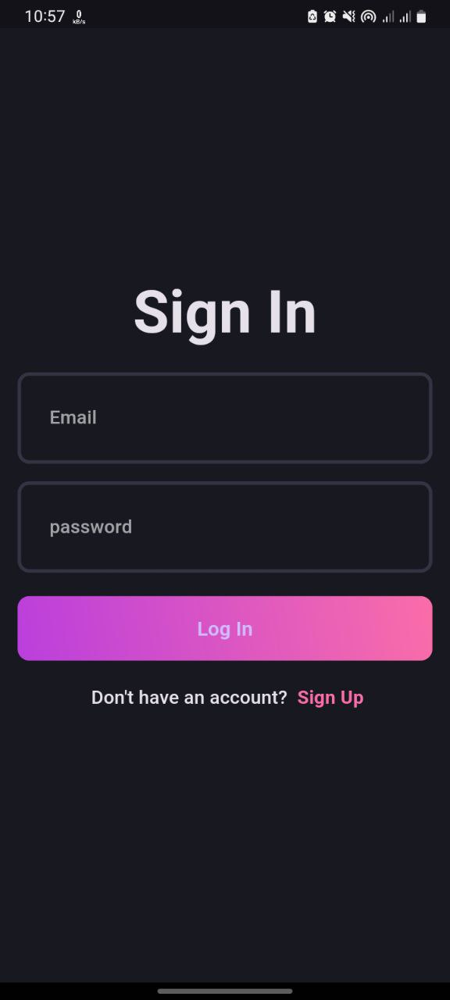
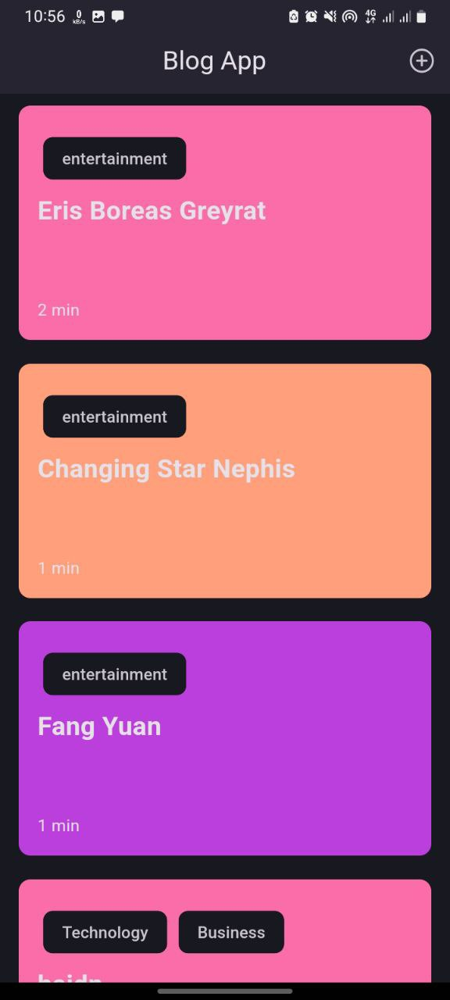
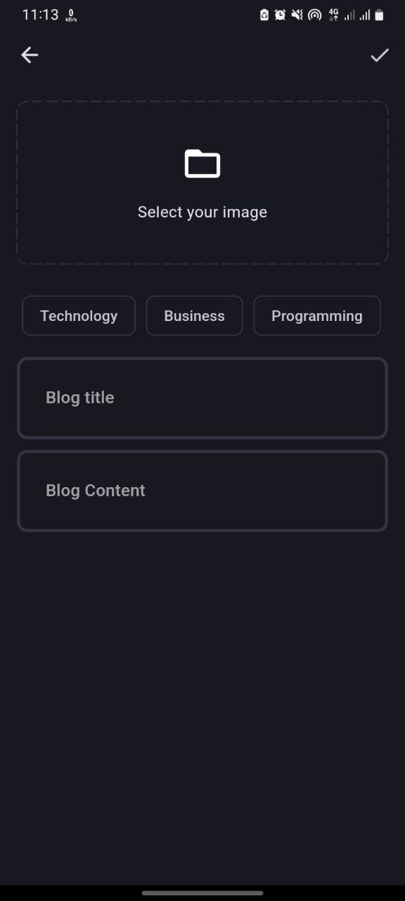

Here’s your **README** without examples, formatted with markdown for GitHub:

---

# Blog App

This is a **Blog App** built using **Flutter**, designed with **Clean Architecture** principles. The app allows users to view, create, update, and delete blog posts. It's modular, scalable, and follows best practices in state management and dependency injection.

## Features

- View blog posts
- Add new blog posts
- Edit existing blog posts
- Delete blog posts
- User authentication via **Supabase**
- Offline data storage using **Hive**
- State management with **BLoC**
- Support for multiple languages via **intl**

## Getting Started

### Prerequisites

Ensure you have the following installed:

- [Flutter SDK](https://flutter.dev/docs/get-started/install)
- [Dart](https://dart.dev/get-dart)
- Android SDK or iOS development tools
- A **Supabase** account (optional, for authentication)

### Installation

1. **Clone the repository**:
   ```bash
   git clone <repository_url>
   cd blog_app
   ```

2. **Install dependencies**:
   ```bash
   flutter pub get
   ```

3. **Set up API keys**:
   Configure your **Supabase** credentials in the project as necessary.

4. **Run the app**:
   ```bash
   flutter run
   ```

## Dependencies Used

- **BLoC**: For state management
- **Flutter Supabase**: For authentication and backend services
- **GetIt**: For dependency injection
- **Hive**: For offline data storage
- **Intl**: For internationalization and localization

## Offline Support

The app uses **Hive** for local data storage, allowing offline functionality. If the user is offline, data is retrieved from the local cache to ensure smooth operation.

## Dependency Injection

The app leverages **GetIt** for dependency injection, making it easier to manage dependencies like repositories and services across the app.

## Internationalization

Internationalization is handled using the **intl** package, allowing the app to support multiple languages.

## Testing

The app includes unit tests for the domain layer and widget tests for the presentation layer. Testing is crucial to ensuring the app works as expected.

### Running Tests

To run the tests:

```bash
flutter test
```

## How to Contribute

1. Fork this repository.
2. Create a new branch: `git checkout -b feature/your-feature`.
3. Make your changes and commit them: `git commit -am 'Add feature'`.
4. Push to the branch: `git push origin feature/your-feature`.
5. Open a pull request.

## License

This project is licensed under the MIT License. See the [LICENSE](LICENSE) file for details.

---

This version keeps things concise without examples, making it clean for GitHub. Let me know if you'd like further edits!


## App Look

### Log In Page


### Sing Up Page


### Blog view Page


### Blog List page


### Blog Add Page

